# Enhanced Autonomous Racing Commentary System

**AI-powered template system** that generates concise racing commentary by combining GPS K=5 position data with TPD performance metrics. This system serves as a **template for AI-generated racing commentary**, producing intelligent, data-focused summaries for horse racing analysis with full source traceability.

*This system generates AI-powered racing commentary using structured templates based on authoritative data sources. All commentary is AI-generated and validated against source data for accuracy and consistency. The templates can be customized to produce different commentary styles while maintaining data integrity.*

## 🎯 AI Commentary Template System

This system generates **template-based AI commentary** that:
- Uses predefined prompt templates for consistency
- Validates against authoritative data sources (no calculations)
- Provides full traceability to original data points
- Follows strict racing terminology standards
- Maintains professional commentary structure
- Serves as a foundation for customized racing analysis

*Note: All commentary is AI-generated using structured templates and validated against source data for accuracy. The system uses specific prompt templates that can be customized for different commentary styles.*

## 🛠️ Tools & Technologies

### Core Technologies
- **Python 3.8+** - Primary programming language
- **Asyncio** - Asynchronous processing for concurrent operations
- **Pydantic** - Data validation and settings management
- **Requests** - HTTP client for API interactions

### AI/ML Frameworks
- **PydanticAI** - Structured AI agents with type safety (Claude)
- **OpenAI API** - Direct API integration (DeepSeek)
- **Anthropic Claude** - Primary AI model (Sonnet 4)
- **DeepSeek** - Backup AI model for reliability

### Data Processing
- **JSON** - Configuration and data interchange
- **NumPy** - Numerical computations
- **GPS K=5 Records** - Position tracking data source
- **TPD APIs** - Performance metrics integration

### Development Tools
- **VS Code** - Development environment
- **Dev Containers** - Containerized development setup
- **uv** - Fast Python package management
- **Git** - Version control

## Quick Start

### Prerequisites
- Python 3.8 or higher
- TPD API keys (Performance + Live Recording)
- AI model API key (Anthropic or DeepSeek)

### Installation & Setup

```bash
# Clone repository
git clone <repository>
cd Post_race_analysis_demo

# Create and activate virtual environment (recommended)
python -m venv venv
source venv/bin/activate  # On Windows: venv\Scripts\activate

# Install dependencies
pip install -r requirements.txt
# OR with uv (recommended)
uv sync

# Create config directory and configuration file
mkdir -p config
cp config_sample.json config/config.json
# Edit config/config.json with your API keys

# Run
python main.py


## Configuration

Create `config/config.json` with your API keys:

```json
{
  "model_provider": "anthropic",
  "anthropic_model": "claude-3-5-sonnet-20241022",
  "anthropic_api_key": "your-anthropic-key",
  "tpd_api_key": "your-tpd-performance-key",
  "tpd_live_recording_api_key": "your-live-recording-key",
  "race_sharecode": "47202502221515",
  "racing_constants": {
    "meters_per_horse_length": 2.4,
    "leader_group_threshold": 1.0,
    "tailed_off_threshold": 3.0,
    "max_leader_group": 3,
    "leader_percentage": 0.25
  }
}
```


## Running the System

### Command Line Mode
```bash
# Basic run
python main.py

# The system will:
# 1. Load configuration
# 2. Fetch TPD performance data
# 3. Download and process GPS data (170k+ records)
# 4. Generate commentary for all horses
# 5. Display results sorted by position
```

### Web Interface Mode (Optional)
```bash
# Start the web server
uvicorn server:app --host 0.0.0.0 --port 8000

# Access at http://localhost:8000
# Configure API keys and race code via web interface
```

## Template-Based AI Commentary Architecture

```mermaid
flowchart TD
    START([Start System]) --> CONFIG{Load Config}
    CONFIG -->|Success| VALIDATE[Validate Keys:<br/>TPD Performance<br/>GPS Recording<br/>AI Model]
    CONFIG -->|Missing| ERROR1[Missing config.json]
    
    VALIDATE -->|Invalid| ERROR2[Missing API Keys]
    VALIDATE -->|Valid| SETUP[Setup AI Model<br/>Claude or DeepSeek]
    
    SETUP --> TEMPLATES[Load Commentary Templates<br/>- Generator Prompt Template<br/>- Critic Prompt Template<br/>- Validation Rules]
    
    TEMPLATES --> PROVIDER{Model Provider?}
    PROVIDER -->|Claude| CLAUDE[PydanticAI Agents<br/>Structured Workflows<br/>Type Safety]
    PROVIDER -->|DeepSeek| DEEPSEEK[OpenAI API Client<br/>Direct Control<br/>Backup System]
    
    CLAUDE --> AGENT[Racing Agent Ready<br/>With Templates Loaded]
    DEEPSEEK --> AGENT
    
    AGENT --> FETCH_PERF[Fetch TPD Performance:<br/>VP, ROS, TTR, Stride<br/>Source of Truth Data]
    FETCH_PERF --> FETCH_GPS[Fetch GPS Recording:<br/>S3 Presigned URL<br/>K=5 Position Data]
    
    FETCH_GPS -->|Success| DOWNLOAD[Download GPS Data<br/>Parse JSON Records<br/>Extract K=5 Packets]
    FETCH_GPS -->|Failed| GPS_ERROR[GPS Data Required<br/>Position Tracking Failed]
    
    DOWNLOAD --> PARSE_GPS[Parse K=5 Records:<br/>G: Furlong Markers<br/>O: Running Order<br/>B: Distance Back]
    PARSE_GPS --> FASTEST[Find Record Holders:<br/>Fastest VP, TTR, ROS<br/>Only These Get Mentions]
    
    FASTEST --> HORSE_LOOP[Process Each Horse<br/>From TPD Performance Data]
    HORSE_LOOP --> EXTRACT[Extract Race Data:<br/>GPS Positions Timeline<br/>Performance Metrics<br/>Distance Back Analysis]
    
    EXTRACT --> CLUSTER[NEW: Intelligent Clustering<br/>For Each Furlong Marker]
    
    CLUSTER --> GAP_CHECK{Gap Analysis<br/>P1 to P2 > 1.0L?}
    GAP_CHECK -->|Yes| CLEAR_LEADER[Clear Leader Identified<br/>Rest = Chasing Pack]
    GAP_CHECK -->|No| TIGHT_CHECK{Horses within 1.0L<br/>of Leader?}
    
    TIGHT_CHECK -->|2 horses| DISPUTED[Disputed Lead]
    TIGHT_CHECK -->|3-6 horses| BUNCHED[Tightly Bunched Leaders]
    TIGHT_CHECK -->|None| STANDARD[Apply Standard Groups]
    
    DISPUTED --> REAR_CHECK{Any Horse >2.0L<br/>Behind Previous?}
    BUNCHED --> REAR_CHECK
    CLEAR_LEADER --> REAR_CHECK
    STANDARD --> REAR_CHECK
    
    REAR_CHECK -->|Yes| DETACHED[Mark as Detached/Rear]
    REAR_CHECK -->|No| MIDFIELD[Remaining = Midfield]
    
    DETACHED --> BUILD_CONTEXT[Build Template Context:<br/>Position Timeline<br/>Key Moves<br/>Performance Records<br/>Distance Data<br/>+ Cluster Terms]
    MIDFIELD --> BUILD_CONTEXT
    
    BUILD_CONTEXT --> APPLY_TEMPLATE[Apply Generator Template:<br/>1. Gate break description<br/>2. Race position flow<br/>3. Key moves with distances<br/>4. Performance stats if record<br/>5. Final furlong if surge<br/>6. MUST include finish position]
    
    APPLY_TEMPLATE --> AI_GEN{AI Provider?}
    AI_GEN -->|Claude| CLAUDE_GEN[PydanticAI Generator<br/>Structured Prompt<br/>Type-Safe Output]
    AI_GEN -->|DeepSeek| DEEPSEEK_GEN[OpenAI API Call<br/>Direct Generation<br/>Text Response]
    
    CLAUDE_GEN --> INITIAL[Initial Commentary<br/>Basic UK English<br/>Racing Terminology]
    DEEPSEEK_GEN --> INITIAL
    
    INITIAL --> VALIDATE_LOOP[Template Validation Loop<br/>Max 3 Iterations<br/>Quality Assurance]
    VALIDATE_LOOP --> APPLY_CRITIC[Apply Critic Template:<br/>1. Position accuracy check<br/>2. Vague language validation<br/>3. Data consistency verify<br/>4. Natural flow assessment<br/>5. Performance mention check]
    
    APPLY_CRITIC --> CRITIC_CALL{Critic Provider?}
    CRITIC_CALL -->|Claude| CLAUDE_CRITIC[PydanticAI Critic<br/>CommentaryResult<br/>Structured Feedback]
    CRITIC_CALL -->|DeepSeek| DEEPSEEK_CRITIC[OpenAI API Critic<br/>JSON Response<br/>Parse to Structure]
    
    CLAUDE_CRITIC --> VALIDATION[Unified Validation:<br/>1. Final Position Match<br/>2. Vague Positioning<br/>3. Data Accuracy<br/>4. Natural Flow<br/>5. Record Mentions]
    DEEPSEEK_CRITIC --> PARSE_CRITIQUE[Parse DeepSeek<br/>Extract JSON<br/>Build CommentaryResult]
    PARSE_CRITIQUE --> VALIDATION
    
    VALIDATION --> VALID_CHECK{All Checks Pass?}
    VALID_CHECK -->|Yes| SUCCESS[Commentary Approved<br/>Template Successfully Applied]
    VALID_CHECK -->|No| FIX_ISSUES[Fix Issues:<br/>Position Accuracy<br/>Language Correction<br/>Data Consistency]
    
    FIX_ISSUES --> ITERATION{Iteration < 3?}
    ITERATION -->|Yes| VALIDATE_LOOP
    ITERATION -->|No| FALLBACK[Use Best Attempt<br/>Ensure Position Included]
    
    SUCCESS --> MORE_HORSES{More Horses?}
    FALLBACK --> MORE_HORSES
    MORE_HORSES -->|Yes| HORSE_LOOP
    MORE_HORSES -->|No| DISPLAY[Display Results:<br/>Sort by Position<br/>Show Performance Data<br/>GPS Position Flow<br/>AI Commentary Source]
    
    DISPLAY --> COMPLETE[System Complete<br/>Templates Applied<br/>Commentary Generated]
    
    ERROR1 --> END_ERROR[System Exit]
    ERROR2 --> END_ERROR
    GPS_ERROR --> END_ERROR
    
    classDef start fill:#e8f5e8,stroke:#2e7d32,stroke-width:3px,color:#000
    classDef process fill:#e3f2fd,stroke:#1976d2,stroke-width:2px,color:#000
    classDef decision fill:#fff3e0,stroke:#f57c00,stroke-width:2px,color:#000
    classDef ai fill:#fff9c4,stroke:#f9a825,stroke-width:2px,color:#000
    classDef error fill:#ffebee,stroke:#d32f2f,stroke-width:2px,color:#000
    classDef success fill:#e8f5e8,stroke:#388e3c,stroke-width:2px,color:#000
    classDef template fill:#f3e5f5,stroke:#7b1fa2,stroke-width:2px,color:#000
    classDef clustering fill:#e1f5fe,stroke:#0277bd,stroke-width:2px,color:#000
    
    class START,COMPLETE start
    class VALIDATE,SETUP,AGENT,FETCH_PERF,FETCH_GPS,DOWNLOAD,PARSE_GPS,FASTEST,HORSE_LOOP,EXTRACT,BUILD_CONTEXT,INITIAL,VALIDATE_LOOP,VALIDATION,FIX_ISSUES,DISPLAY process
    class CONFIG,PROVIDER,AI_GEN,CRITIC_CALL,VALID_CHECK,ITERATION,MORE_HORSES,GAP_CHECK,TIGHT_CHECK,REAR_CHECK decision
    class CLAUDE,DEEPSEEK,CLAUDE_GEN,DEEPSEEK_GEN,CLAUDE_CRITIC,DEEPSEEK_CRITIC,PARSE_CRITIQUE ai
    class ERROR1,ERROR2,GPS_ERROR,END_ERROR error
    class SUCCESS,FALLBACK success
    class TEMPLATES,APPLY_TEMPLATE,APPLY_CRITIC template
    class CLUSTER,CLEAR_LEADER,DISPUTED,BUNCHED,STANDARD,DETACHED,MIDFIELD clustering
```



## Commentary Template Details

### Generator Template Structure
The system uses a structured template for generating commentary:

```
1. Gate Break: Simple description of start
2. Position Flow: Vague racing terms throughout
3. Key Moves: Significant position changes
4. Performance Stats: Only for record holders
5. Final Furlong: If 2+ position surge
6. Finish Position: MANDATORY inclusion
```

### Critic Template Validation
The validation template ensures:

```
1. Position Accuracy: Exact finish position match
2. Language Check: Vague positioning terms only
3. Data Validation: All claims traceable to source
4. Flow Assessment: Natural racing commentary style
5. Performance Check: Only record holders mentioned
```

### Template Variables
- **Final Position**: From TPD performance data
- **GPS Positions**: K=5 record position flow
- **Distance Back**: Intelligent reporting (significant gaps only)
- **Performance Records**: VP, TTR, ROS for fastest horses
- **Position Changes**: 2+ position moves detected

## Data Sources

### TPD Performance Metrics API
- **Endpoint**: `https://www.tpd.zone/json-rpc/v3/performance/`
- **Provides**: VP (Velocity Peak), ROS (Run Out Speed), TTR (Time To Reach), stride data
- **Usage**: Final race statistics and performance records identification
- **Key Fields**: Already in mph, no conversion needed

### TPD GPS Live Recording API
- **Endpoint**: `https://tpdapi.tpd.zone/live-recording/raw/`
- **Provides**: Raw GPS packets including K=5 position records
- **Usage**: **Primary source** for position tracking and mid-race narrative
- **K=5 Record Structure**:
  - **G**: Gate/Furlong marker (6f, 5f, 4f, 3f, 2f, 1f)
  - **O**: Running order array (exact positions)
  - **B**: Distance back array (meters behind leader)
  - **R**: Running time at furlong marker

## Key System Features

### ✅ Template-Based Commentary Generation
- **Structured Prompts**: Consistent commentary format
- **Validation Templates**: Quality assurance rules
- **Source Traceability**: Every claim linked to data
- **Customizable**: Templates can be modified for different styles

### ✅ Enhanced Performance Metrics
- **Top-N Assignment**: Multiple horses recognized per metric
- **Priority Hierarchy**: One metric per horse based on priority
- **Clear Rankings**: "race's fastest speed" vs "2nd fastest"

### ✅ Intelligent GPS Clustering
- **Gap-Based Analysis**: Dynamic position grouping
- **Racing Terminology**: Natural language positioning
- **Distance Reporting**: Significant gaps only

### 🔧 Simplified Configuration
- **Fewer API Keys**: Only Performance + GPS Recording APIs
- **Mandatory GPS Data**: System fails if GPS data unavailable
- **Cleaner Architecture**: Direct data flow without intermediate processing

## AI Model Architecture & Template Processing

### Unified Template Processing for Both Providers

The system provides **identical commentary quality** regardless of AI provider through unified template application:

#### **Claude (Anthropic) - PydanticAI Structured Agents**
```python
# Type-safe structured agents with templates
generator = Agent(model="claude-3-5-sonnet-20241022", 
                 output_type=str,
                 system_prompt=generator_template)
critic = Agent(model="claude-3-5-sonnet-20241022", 
              output_type=CommentaryResult,
              system_prompt=critic_template)

# Structured execution with automatic validation
result = await generator.run(template_context)
critique = await critic.run(validation_template)
```

#### **DeepSeek - OpenAI API with Custom Template Parsing**
```python
# Direct API control with template injection
response = client.chat.completions.create(
    model="deepseek-chat",
    messages=[{"role": "system", "content": generator_template},
              {"role": "user", "content": template_context}],
    temperature=0.7
)

# Parse to same structured format
result = self.parse_deepseek_critique(response.choices[0].message.content)
```

### **Template Quality Assurance Pipeline**

Both providers follow identical 5-step template validation:

1. **Position Accuracy**: Final position must match TPD data exactly
2. **Language Validation**: Vague positioning terminology enforced
3. **Data Consistency**: Distance back claims validated against GPS K=5 data
4. **Racing Flow**: Natural commentary style verification
5. **Performance Mentions**: Only record holders get speed mentions

## Example Output

```
🏇 GRAFT - Horse #8
📍 Position: 7
🎯 ASSIGNED METRIC: fastest top speed (43.3)
📊 Peak: 43.3mph | Finish: 33.5mph [TPD DATA]
📍 GPS Positions: 6f:8 → 5f:7 → 4f:6 → 3f:5 → 2f:5 → 1f:7
🤖 ANTHROPIC: Settled into midfield after the break and recorded the race's fastest speed of 43.3mph, running consistently 3-4 lengths behind the leaders. Made brief headway approaching the 2f marker before weakening, and finished 7th.
```

## Commentary Template Rules

### Must Include (Template Requirements)
- **Final Position**: Exact finishing position (e.g., "finished 4th")
- **Vague Positioning**: Racing vernacular throughout ("leaders", "midfield", "rear")
- **Source Traceability**: All claims traceable to TPD/GPS data
- **Simple Language**: Basic UK racing terminology

### Performance Mentions (Record Holders Only)
- **Top Speed**: Only for race's fastest VP horse
- **Time To Reach**: Only for quickest TTR horse  
- **Run Out Speed**: Only for strongest ROS finish
- **Final Furlong Surge**: Only if gained 2+ positions in final furlong

### Template Guidelines
- **Maximum 3 sentences, 100 words**
- **No specific mid-race positions** (avoid "4th", "5th")
- **Distance mentions in horse lengths** (intelligent reporting)
- **Natural racing flow** with professional terminology

## Error Handling & Reliability

### Configuration Errors
- **Missing API Keys**: Clear error messages with required fields
- **Invalid Race Codes**: Validation before processing
- **Model Provider Issues**: Automatic fallback to working provider

### Data Processing Errors
- **GPS Data Unavailable**: System fails fast (GPS required for positions)
- **Performance Data Missing**: Graceful degradation with warnings
- **API Rate Limits**: Automatic retry with backoff

### Template Generation Errors
- **Validation Failures**: Maximum 3 retry attempts with improvement
- **Position Accuracy**: Automatic correction using TPD as source of truth
- **Language Issues**: Iterative refinement until vague positioning achieved

## Installation Options

### Using pip
```bash
pip install -r requirements.txt
```

### Using uv (Recommended)
```bash
uv sync
```

### Dev Container
Open in VS Code with Dev Containers extension for automatic setup.

## Usage Flow

1. **Configure**: Create `config/config.json` with TPD Performance + GPS Recording API keys
2. **Run**: Execute `python main.py` - fully automated processing
3. **Monitor**: System processes all horses with real-time status updates
4. **Review**: Results displayed sorted by finishing position with GPS position flow

### Template-Based Commentary Generation Process

1. **Data Extraction**: GPS K=5 positions + TPD performance metrics
2. **Context Building**: Furlong-by-furlong position timeline
3. **Template Application**: Structured prompts generate commentary
4. **Validation**: 5-step quality assurance with iterative improvement
5. **Final Output**: Professional racing commentary with source traceability

## Project Structure

```
Post_race_analysis_demo/
├── main.py              # Core racing agent and logic
├── server.py            # Optional web interface
├── config/
│   └── config.json      # Configuration file
├── static/
│   └── index.html       # Web UI (if using server)
├── requirements.txt     # Python dependencies
└── README.md           # This file
```

## Troubleshooting

### Common Issues

1. **"0 GPS positions" Error**
   - Check GPS data extraction field names (O, B, R not order, distance_back)
   - Verify race sharecode is correct
   - Ensure GPS Live Recording API key is valid

2. **Missing Performance Metrics**
   - Verify TPD Performance API key
   - Check if race data is available
   - Some races may have incomplete data

3. **Generic Commentary**
   - GPS data not reaching AI prompts
   - Check position timeline building
   - Verify clustering calculations

4. **Long Processing Time**
   - GPS files can be 170k+ records
   - Normal processing time: 2-5 minutes
   - Consider implementing progress indicators

# Racing-Post
